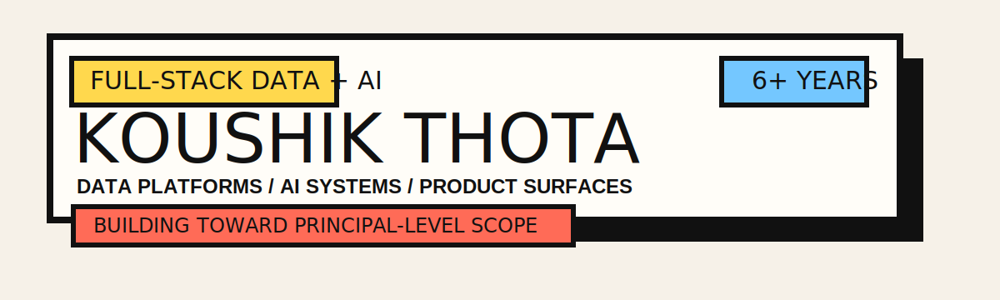

  

  

Senior data engineer building toward principal-level ownership across full-stack data and AI systems.

## NOW / NEXT

| NOW | NEXT |
| --- | --- |
| Building cloud data platforms, analytics systems, and AI-enabled workflows. | Expanding into broader architecture ownership across data, APIs, agents, evaluation, and product surfaces. |

## WHAT I BUILD

| AREA | SCOPE |
| --- | --- |
| Data Platforms | Batch ETL/ELT, streaming workflows, lakehouse pipelines, warehouse flows, and operational sync systems |
| Cloud Delivery | AWS and Azure systems, serverless architectures, CDK, Terraform, and CI/CD-backed delivery |
| Analytics | Reporting automation, Tableau tooling, quality checks, schema guardrails, and internal analytics workflows |
| AI Systems | AI-assisted workflows, orchestration, MCP integrations, evaluation, and practical guardrails |
| Product Surfaces | Backend services and lightweight UI when data and AI systems need a real interface |

## STRENGTHS

- Modernizing older enterprise data flows without losing reliability.
- Connecting data engineering, AI workflows, and product-facing systems.
- Building systems that are easier to debug, trust, and operate.
- Taking ownership from implementation through rollout.

## TOOLBOX

  <code>PYTHON</code> <code>SQL</code> <code>SCALA</code> <code>TYPESCRIPT</code> 
  <code>PYSPARK</code> <code>KAFKA</code> <code>AIRFLOW</code> <code>ICEBERG</code> <code>DUCKDB</code> 
  <code>AWS</code> <code>AZURE</code> <code>GCP</code> <code>LAMBDA</code> <code>STEP FUNCTIONS</code> <code>CDK</code> 
  <code>REDSHIFT</code> <code>SNOWFLAKE</code> <code>BIGQUERY</code> <code>POSTGRESQL</code> 
  <code>LANGCHAIN</code> <code>LANGGRAPH</code> <code>LANGSMITH</code> <code>MCP</code> 
  <code>CLAUDE CODE</code> <code>GEMINI CLI</code> <code>TERRAFORM</code> <code>JENKINS</code> <code>TABLEAU</code>

## CREDENTIALS

  
  
  

